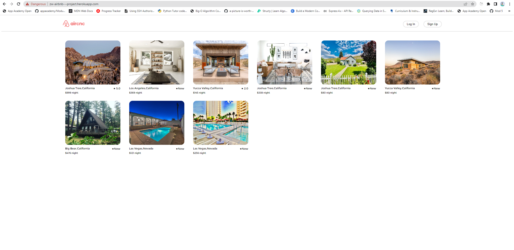

# Aircnc Project
## What's this?
Aircnc is a simple full-stack clone project that originally cloned from airbnb. The goal of this project is for developers to practice using different technologies and build their first web application from scratch.
## Languages of Development
- Frontend: React, Redux
- Backend: Express, Sequelize
- Database: SOLight(local), PostgreSQL(Heroku)
## How to launch the full application locally
1. Download entire application folder to local computer.
2. Change directory to backend folder.
3. Run npm install on backend folder.
4. Add .env file for local environment.
5. Build the local database by running the following commands:npx run sequelize db:migrate; npx run sequelize db:seed:all
6. Start the backend server by runing: npm start
7. Change directory to frontend folder.
8. Start the frentend server by runing: npm start
## Project Showcase

